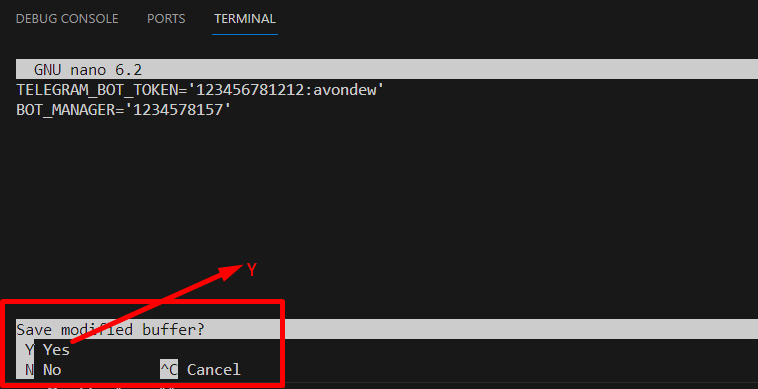

# Last Burn Competition Bot
This guide assume the client already connected to ubuntu server(for example, digital ocean) by the root permission.

## Environment

You should setup the following version or above.
```text
OS: Ubuntu 22.04.3 LTS
node: v16.20.2
yarn: 1.22.19
npm: 8.19.4
```

### How to setup and check the environment

You should purchase the Ubuntu server. Then you can connect the server via ssh by using username and password.
Once you've connected the server, you can check the OS information using the following command.
```shell
lsb_release -a
```

Then, you will see the OS information
```shell
Distributor ID: Ubuntu
Description:    Ubuntu 22.04.3 LTS
Release:        22.04
Codename:       jammy
```

Then, you should update the server packages
```shell
apt update
apt list --upgradable
apt upgrade
```

Then, you should install nodejs, npm and yarn by using the following commands
```shell
apt install mc
apt install git
apt install curl
curl https://raw.githubusercontent.com/creationix/nvm/master/install.sh | bash
export NVM_DIR="$HOME/.nvm"
[ -s "$NVM_DIR/nvm.sh" ] && \. "$NVM_DIR/nvm.sh"  # This loads nvm
[ -s "$NVM_DIR/bash_completion" ] && \. "$NVM_DIR/bash_completion"  # This loads nvm bash_completion
source ~/.profile
nvm install 16.20.2
nvm use 16.20.2
nvm alias default 16.20.2
npm install --location=global yarn
```

You can check the node version.
```shell
node -v
```

Then, you will see the node version
```shell
v16.20.2
```

You can check the yarn version.
```shell
yarn -v
```

Then, you will see the yarn version
```shell
1.22.19
```

You can check the npm version.
```shell
npm -v
```

Then, you will see the npm version
```shell
8.19.4
```

## Run Multiple Competitions

```shell
cd /
mkdir competitions
cd competitions
```

### Create competitionA
If you want to run the bot for the competitionA, you can start from `competitions` folder.

#### Create competitionA folder
Create competitionA folder
```shell
cd /competitions/
mkdir competitionA
cd competitionA/
```

#### Get Bot Token
In order to use this bot yourself, you'll need to get a token for the Telegram bot.
You can create a bot and get its token using [@BotFather](https://t.me/botfather) inside the app.

#### Get Chat ID
In order to know your chat id with your bot, you can use [@ShowJsonBot](https://t.me/ShowJsonBot) inside the app.
You can forward your message to this bot, and this bot will show the chat id.

#### Clone source code from github and config .env file
Clone the github repo

```shell
git clone https://github.com/nourozi/last-burn-competition-bot.git
cd last-burn-competition-bot/
```

Config .env file.
The Bot token and chat ID are the private info, so we should config this info as manually.
Once you've got Telegram Bot Token and Chat ID, please copy .env.example to .env and copy your token and chat id.
```shell
cp .env.example .env
```

```shell
nano .env
```

Then, you will see as following:


You should put the bot token and chat id on the above image and save it.


You will use the command [Ctrl+X] and the command  [Y] and the [Enter] to save it.



You can check the .env file with this command.
```shell
cat .env
```


If bot token and chat id are incorrect, pleas try again to put correct information.

### Install packages
```shell
yarn
```

### Run the bot
```shell
yarn start-bot
```

### Stop the bot
```shell
yarn stop-bot
```

And that's all, you can now interact with your bot using Telegram.

If you want to run the bot for competitionB, you should loop the process from `Create competitionA` with `competitionB`

